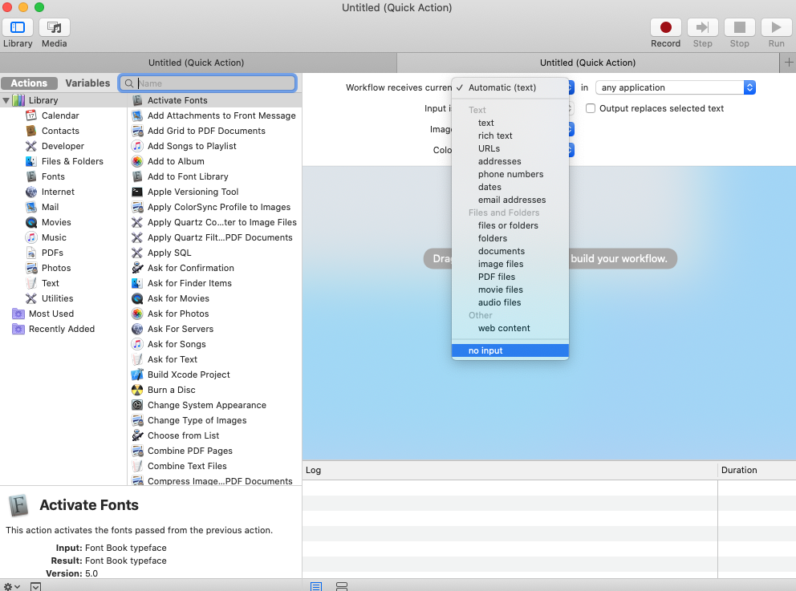

Switching between devices is already pretty seamless with AirPods. Once they've been paired to one of your Apple products, they will instantly be accessible on any other Apple products you own. The one thing I've found annoying is that while it connects pretty quickly on iOS, it's a bit slower on macOS and there's no keyboard shortcut. Let's fix that.

## Install Homebrew

[Homebrew](https://brew.sh/) is a package manager for macOS. You can install it with this command:

```js
/bin/bash -c "$(curl -fsSL https://raw.githubusercontent.com/Homebrew/install/master/install.sh)"
```

## Install BluetoothConnector

[BluetoothConnector](https://github.com/lapfelix/BluetoothConnector) is a macOS CLI to connect/disconnect a Bluetooth device. It's not limited to AirPods. It will make connecting any bluetooth devices to your Mac easier. Once Homebrew is installed you can install BluetoothConnector with this command:

```js
brew install bluetoothconnector
```

Once it's installed, run this command to get a list of bluetooth devices and their corresponding MAC address.

```js
bluetoothconnector
```

Copy the MAC address next to your AirPods and open Automator. Select "Quick Action" as your document type.

[]()

Change the "Workflow receives current" dropdown to "no input".

[]()

Drag "Run Shell Script" from the left sidebar into your workflow. And add this command to the text area: 

```js
/usr/local/bin/BluetoothConnector YOUR AIRPODS MAC ADDRESS --notify
```

Replace YOUR AIRPODS MAC ADDRESS with the MAC address you copied earlier. It should look something like this:


[]()

Save the Automator Service as "Connect Airpods". Open up System Preferences > Keyboard. Click on the Shortcuts tab. Select Services from the left sidebar and scroll down the right sidebar until you see the Connect AirPods Service. Click Add Shortcut and choose a keyboard shortcut. 

[]()

Now you can quickly connect/disconnect your AirPods with a simple Keyboard shortcut. It's much faster too!