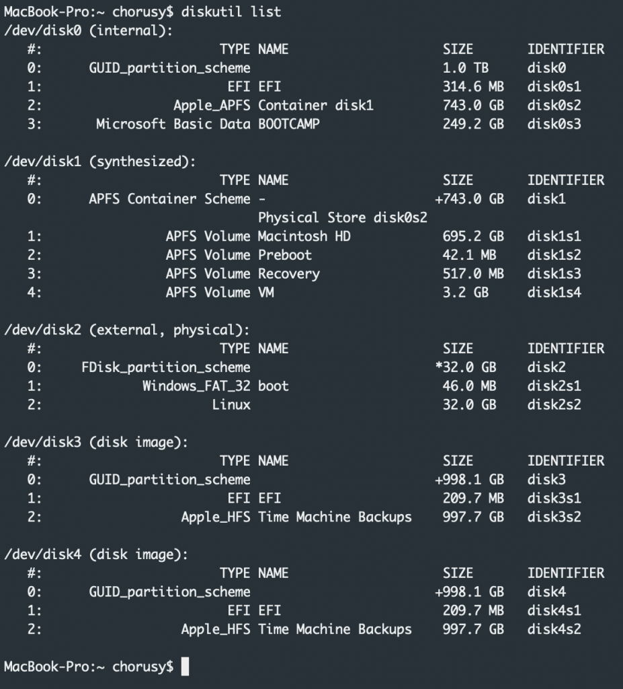
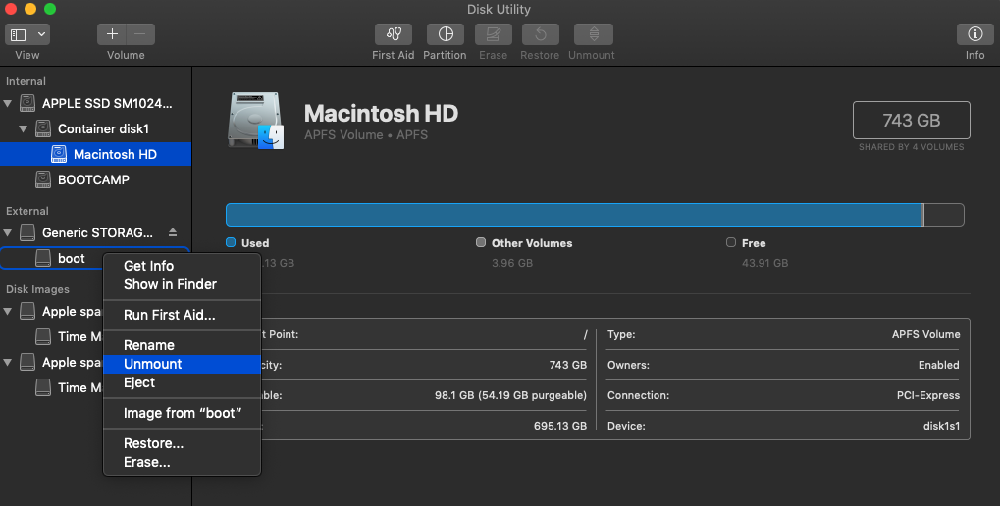
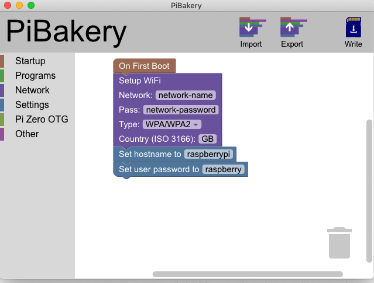

Installing Raspbian OS to a Raspberry Pi is easy enough, but with some extra tools we can streamline this process. Here are some of the different ways you can install Raspbian onto your Raspberry Pi.

## Terminal Based Installs

### Using dd install

This is the official method from the Raspberry Pi Foundation (https://www.raspberrypi.org/documentation/installation/installing-images/mac.md)  

1. plug your SD card into your computer.
2. open the terminal app and run 'diskutil list'

```js
diskutil list
```

[]()
&nbsp;
3. Locate your usb from the list. (in my case it is the 'boot' volume on disk2)
4. Open Disk Utility and unmount your SD card

[]()

5. Run the following command from terminal: 
```js
sudo dd bs=1m if=path_of_your_image.img of=/dev/rdiskn conv=sync. 
```
Replace the n after disk with the number found in diskutil list

This option is nice and easy, however, the only downside is that there's no confirmation that anything is actually installing until the process has finished. Because of this, I've found using PV to be a better way to install Raspbian.

Using dd install with PV

To use PV, first install homebrew with this terminal command: 
```js
ruby -e "$(curl -fsSL https://raw.githubusercontent.com/Homebrew/install/master/install)" < /dev/null 2> /dev/null
```

Once homebrew has been installed, run this command to install PV: 
```js
brew install pv
```

To continue installing Raspbian to the SD card, follow steps 1-4 above. For step 5, replace the original command with this: 
```js
sudo dd if=path-of-your_image.img | pv -s 2G | sudo dd of=/dev/rdiskn bs=1m
```

[]()

Awesome! Now we can actually see that something is installing as well as an ETA.

## GUI Based Installs

For those of us that are a little more frightened of the command line, there are some great alternatives

### Using NOOBS

NOOBS is designed to be the easiest way to install Raspbian OS.

Download the software
Copy the downloaded files to an SD card
Plug the SD card into your Raspberry Pi and power on.
Follow the installer wizard to install your OS.

[]()

### Using PiBakery

PiBakery is an awesome tool that is both easy to use an advanced. It makes installing Raspbian extremely easy but also allows for a multitude of options.

[]()

Simply plug your SD card into your computer, choose some options and click 'write'. Nice and easy :)
